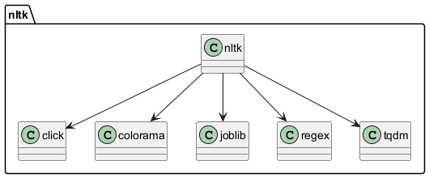

# 1. Клонирование репозитория

Склонируйте репозиторий с исходным кодом и тестами:

```
git clone <URL репозитория>
cd <директория проекта>
```

# 2. Установка зависимостей при запуске

```
pip install subprocess
pip install setuptools
```

# Создайте виртуальное окружение

```bash
# Активируйте виртуальное окружение
python -m venv venv
# Для Windows:
venv\Scripts\activate
# Для MacOS/Linux:
source venv/bin/activate
```


# 3. Структура проекта
Проект содержит следующие файлы и директории:
```bash
unittests.py              # файл для тестирования
hw2.py                  # файл с программой
plantuml.jar           # plantuml
file.puml             # файл с выводом программы 
```

# 4. Запуск проекта
```bash
pip install nltk        # имя пакета
py hw2.py plantuml.jar nltk 1 https://github.com/nltk/nltk
```


# 5. Тестирование с моим репозитеорием 
Вывод программы
```
@startuml
package "nltk" {
  "nltk" --> "click"
  "nltk" --> "colorama"
  "nltk" --> "joblib"
  "nltk" --> "regex"
  "nltk" --> "tqdm"
}
@enduml
```

